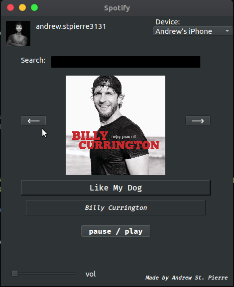

# spotify-widget
> Widget music-player for Spotify using Spotify's API (w/ Spotipy's Python wrapper) and PyQt5

## Screenshot

### Next steps  
* integrate a search mechanism  
* integrate some ML to generate a next-track option list

## Acknowledgments
* [Spotipy Python Library for Spotify's API](https://github.com/plamere/spotipy)
* [Spotify Web API](https://developer.spotify.com/documentation/web-api/)
